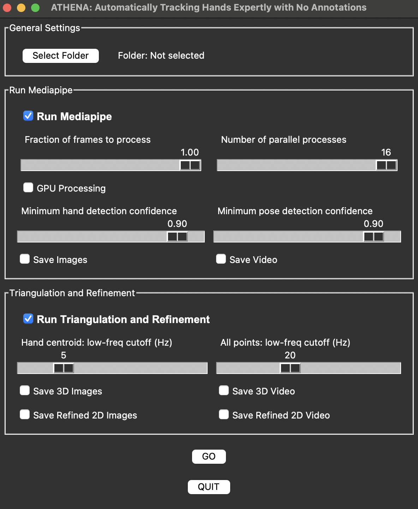

# ATHENA Toolbox

**ATHENA** (Automatically Tracking Hands Expertly with No Annotations) is a Python toolbox for markerless 3D hand, body, and face tracking from synchronized multi-camera video. It implements a two-phase pipeline: (1) per-camera 2D landmark detection using MediaPipe (with an optional HaMeR hand-mesh backend), followed by (2) multi-camera DLT triangulation, temporal smoothing, and cross-camera hand-swap correction to produce refined 3D landmarks. The toolbox ships with a Tkinter GUI for configuring and launching all processing steps.

Check out our [paper](https://doi.org/10.1152/jn.00407.2025) published in the *Journal of Neurophysiology* for more information.

<table>
  <tr>
    <td></td>
    <td></td>
  </tr>
</table>

## Features

- **Multi-camera processing** -- handles an arbitrary number of synchronized camera inputs.
- **MediaPipe integration** -- body pose (33 landmarks), hand (21 landmarks per hand), and face mesh (478 landmarks) detection via Google MediaPipe.
- **HaMeR hand-mesh regression** (optional) -- high-quality MANO mesh recovery (778 vertices per hand) as an alternative to MediaPipe hands, using MediaPipe bounding boxes fed into [HaMeR](https://github.com/geopavlakos/hamer).
- **Cross-camera hand reassignment** -- after independent per-camera detection, body wrists are triangulated to 3D and reprojected into every camera to reassign hand labels, fixing left/right misassignments.
- **Spatially inconsistent hand rejection** -- hand detections whose wrist root deviates more than a threshold (default 60 px) from the reprojected 3D body wrist are rejected, preventing noisy detections from corrupting triangulation.
- **Face mesh tracking** -- optional 478-landmark face mesh via MediaPipe FaceLandmarker, triangulated and smoothed alongside body and hand data.
- **DLT triangulation with outlier filtering** -- iterative reprojection-error camera filtering (30 px threshold) removes outlier cameras per landmark per frame.
- **Temporal smoothing** -- Savitzky-Golay low-pass filter with configurable frequency cutoff.
- **Parallel processing** -- multiprocessing across cameras for the 2D detection phase.
- **GUI for easy configuration** -- Tkinter interface for folder selection, backend choice, confidence thresholds, and visualization options.
- **Visualization** -- colour-coded skeleton overlays, Lambertian-shaded hand mesh rendering, 3D skeleton plots, and montage video generation.

## Installation

### Prerequisites

- **OS**: Windows, macOS, or Linux
- **Python**: 3.12
- **Hardware**: Multi-core CPU recommended. GPU optional (NVIDIA for CUDA, or Apple Silicon via MPS for HaMeR).

### Install

Create and activate an environment with Python 3.12:

```console
conda create -n athena python=3.12
conda activate athena
```

Install from PyPI:

```console
pip install athena-tracking
```

Or install the latest development version from GitHub:

```console
pip install git+https://github.com/neural-control-and-computation-lab/athena.git
```

### Optional: HaMeR hand-mesh backend

HaMeR requires PyTorch and several additional packages. Install them after the base package:

```console
pip install athena-tracking[hamer]
pip install --no-deps git+https://github.com/geopavlakos/hamer.git
```

The first command installs PyTorch and all HaMeR sub-dependencies. The second installs HaMeR itself from source (the `--no-deps` flag is needed because HaMeR's own dependency list includes rendering packages that are not required for ATHENA's keypoint-only usage).

On first run with HaMeR enabled, model checkpoints will be downloaded automatically into `_DATA/`.

## Usage

### 1. Organize Your Videos

Place synchronized video recordings in a main folder with this structure:

```
main_folder/
├── videos/
│   ├── recording1/
│   │   ├── cam0.avi
│   │   ├── cam1.avi
│   │   └── ...
│   ├── recording2/
│   │   ├── cam0.avi
│   │   ├── cam1.avi
│   │   └── ...
└── calibration/
    ├── cam0.yaml      # or a single .toml file (Anipose format)
    ├── cam1.yaml
    └── ...
```

- Each recording folder contains one video per camera (`.avi` or `.mp4`).
- The `calibration/` folder contains per-camera intrinsic and extrinsic parameters in YAML (JARVIS format) or a single TOML file (Anipose format).

For recording and calibrating cameras, we recommend the [JARVIS Toolbox](https://jarvis-mocap.github.io/jarvis-docs/).

### 2. Ensure Calibration Files are Correct

- Camera names in calibration files must match the video filenames.
- Files must contain intrinsic matrices, distortion coefficients, and extrinsic parameters (rotation + translation).
- ATHENA accepts calibration files from JARVIS or Anipose without modification.

### 3. Launch the GUI

```console
athena
```

1. **Select Main Folder and Recordings** -- click "Select Folder", then choose recordings from the popup list.
2. **Configure Processing Options**:
   - *General*: fraction of frames to process, number of parallel processes, GPU toggle.
   - *2D Extraction*: enable/disable, hand and pose confidence thresholds, save images/video.
   - *Hand Backend*: MediaPipe (default) or HaMeR.
   - *Face Mesh*: optionally include 478 face landmarks.
   - *Triangulation & Refinement*: enable/disable, low-frequency smoothing cutoff (Hz), save 3D and refined 2D images/video.
3. **Start Processing** -- click "GO". A progress bar displays per-camera progress and average FPS.

### 4. Create a Montage Video

Combine all camera views (2D and 3D) into a single montage:

```console
athena-montage
```

Or equivalently:

```console
python -m athena.montage
```

## Architecture

### Pipeline Overview

```
Phase 1: 2D Detection (labels2d)
  Per camera (parallel):
    Video frames --> MediaPipe Pose (33 body landmarks)
                 --> MediaPipe Hands or HaMeR (21 landmarks per hand, optional 778 mesh vertices)
                 --> MediaPipe FaceLandmarker (optional, 478 face landmarks)
  Cross-camera:
    Triangulate body wrists --> reproject --> reassign/reject hands

Phase 2: Triangulation & Refinement (triangulaterefine)
    Load per-camera 2D landmarks
    --> Correct left/right hand swaps across cameras
    --> Undistort 2D points
    --> DLT triangulation with reprojection-error camera filtering
    --> Savitzky-Golay temporal smoothing
    --> Reproject smoothed 3D back to each camera
    --> (Optional) Triangulate HaMeR mesh vertices
    --> Generate visualization images/videos
```

### Modules

| Module | Description |
|---|---|
| `athena.athena` | Tkinter GUI launcher and entry point (`athena` CLI command). |
| `athena.labels2d` | Phase 1 -- per-camera 2D landmark detection, cross-camera hand reassignment, and video I/O. Contains both the pure-MediaPipe and the hybrid (MediaPipe + HaMeR) processing paths. |
| `athena.triangulaterefine` | Phase 2 -- DLT triangulation, Savitzky-Golay smoothing, hand-swap correction, HaMeR vertex triangulation, and 2D/3D visualization rendering. |
| `athena.visualization` | Shared skeleton topology (`SKELETON_LINKS`), colour palettes, `draw_landmarks_unified()` for skeleton overlays, and `render_mesh_overlay()` for Lambertian-shaded mesh rendering. |
| `athena.hamer_hands` | Optional HaMeR hand-mesh regression backend. Lazily imports PyTorch/HaMeR. Supports CUDA, MPS, and CPU. Provides `load_models()`, `detect_hands_mp_landmarks()`, `get_mano_faces()`, and `is_available()`. |
| `athena.montage` | Multi-camera video montage creation (`athena-montage` CLI command). |

## Output

### Folder Structure

After processing, ATHENA creates the following directories:

```
main_folder/
├── images/                  # 2D landmark overlay images (per camera)
├── imagesrefined/           # Reprojected refined 2D overlays + 3D skeleton plots
├── landmarks/
│   └── <recording>/
│       ├── cam0/
│       │   ├── 2Dlandmarks_body.npy
│       │   ├── 2Dlandmarks_right.npy
│       │   ├── 2Dlandmarks_left.npy
│       │   ├── 2Dlandmarks_face.npy          # if face mesh enabled
│       │   ├── hamer_vertices_2d_left.npy    # if HaMeR enabled
│       │   ├── hamer_vertices_2d_right.npy   # if HaMeR enabled
│       │   └── ...
│       ├── cam1/
│       │   └── ...
│       ├── hamer_faces.npy                    # MANO triangle indices (if HaMeR)
│       ├── <recording>_3Dlandmarks.npy        # final 3D landmarks
│       └── <recording>_2Dlandmarksrefined.npy # reprojected 2D landmarks
├── videos_processed/        # Processed videos with landmark overlays
└── ...
```

### 3D Landmark File Format

The primary output is `<recording>_3Dlandmarks.npy`, a NumPy array:

- **Shape**: `(nframes, nlandmarks, 3)` where each row is `[X, Y, Z]` in the calibration coordinate system.
- **Without face mesh**: `nlandmarks = 75`
- **With face mesh**: `nlandmarks = 75 + 478 = 553`

**Landmark ordering (indices along axis 1):**

| Index range | Count | Source |
|---|---|---|
| 0 -- 32 | 33 | Body (MediaPipe Pose Landmarker) |
| 33 -- 53 | 21 | Right hand (MediaPipe / HaMeR keypoints) |
| 54 -- 74 | 21 | Left hand (MediaPipe / HaMeR keypoints) |
| 75 -- 552 | 478 | Face (MediaPipe FaceLandmarker, if enabled) |

Notable indices: right wrist = 33, left wrist = 54.

See the [MediaPipe Pose Landmarker](https://developers.google.com/mediapipe/solutions/vision/pose_landmarker) and [MediaPipe Hand Landmarker](https://developers.google.com/mediapipe/solutions/vision/hand_landmarker) documentation for the detailed ordering within each group.

### HaMeR Mesh Vertices

When HaMeR is used, per-camera 2D mesh vertices are saved as `hamer_vertices_2d_{left,right}.npy` with shape `(nframes, 778, 2)`. Triangle indices are saved once per recording as `hamer_faces.npy` with shape `(F, 3)` using the MANO topology. These vertices are triangulated to 3D during Phase 2 and used for shaded mesh visualization.

### Refined 2D Landmarks

`<recording>_2Dlandmarksrefined.npy` has shape `(ncams, nframes, nlandmarks, 2)` and contains the 3D landmarks reprojected back into each camera's pixel space after smoothing.

## API Reference

### `athena.labels2d`

| Function | Description |
|---|---|
| `main(gui_options_json)` | Entry point for Phase 1. Parses GUI options, dispatches to MediaPipe or hybrid processing, runs cross-camera hand reassignment. |
| `run_mediapipe(...)` | Pure MediaPipe processing path (body + hands, optional face). |
| `run_hybrid(...)` | Hybrid processing path (MediaPipe body/bounding boxes + HaMeR hands). |
| `process_camera(...)` | Per-camera MediaPipe detection loop. |
| `process_camera_hybrid(...)` | Per-camera hybrid (MediaPipe + HaMeR) detection loop. |
| `read_calibration(calibration_files, extension)` | Load camera calibration from YAML or TOML files. Returns intrinsic matrices, extrinsic matrices, and distortion coefficients. |
| `create_video(image_folder, extension, fps, output_folder, video_name)` | Compile a folder of images into a video file. |

### `athena.triangulaterefine`

| Function | Description |
|---|---|
| `main(gui_options_json)` | Entry point for Phase 2. Triangulates, smooths, reprojects, and renders all trials. |

### `athena.visualization`

| Function / Constant | Description |
|---|---|
| `draw_landmarks_unified(...)` | Draw skeleton (and optionally shaded hand meshes) on a BGR image. |
| `render_mesh_overlay(...)` | Render a filled, depth-sorted, Lambertian-shaded mesh overlay. |
| `hex_to_bgr(hexcode)` | Convert hex colour string to BGR tuple. |
| `SKELETON_LINKS` | List of `[i, j]` index pairs defining the full skeleton topology (body + hands). |
| `BODY_LINKS` | Subset of `SKELETON_LINKS` for body-only rendering. |

### `athena.hamer_hands`

| Function | Description |
|---|---|
| `is_available()` | Check whether HaMeR and PyTorch are importable. |
| `load_models(device, use_gpu)` | Initialize HaMeR model (cached after first call). Returns `(model, cfg, device)`. |
| `get_mano_faces()` | Return MANO mesh triangle indices as `(F, 3)` array. |
| `detect_hands_mp_landmarks(...)` | Run HaMeR on a cropped hand image and return 21 keypoints + 778 mesh vertices. |

### `athena.montage`

| Function | Description |
|---|---|
| `main()` | GUI for selecting a recording folder and generating a multi-camera montage video. |

## Troubleshooting

- **MediaPipe errors**: Ensure MediaPipe is compatible with Python 3.12. GPU delegate support varies by platform.
- **HaMeR import errors**: Verify that `torch`, `torchvision`, and `hamer` are installed. Run `python -c "from athena.hamer_hands import is_available; print(is_available())"` to test.
- **Calibration mismatch**: The number of calibration entries must match the number of camera videos per recording.
- **High memory usage**: Saving images and videos consumes significant storage. Process a subset of frames first (fraction slider) to estimate disk requirements.
- **Permission issues**: Ensure read/write permissions for all data directories.
- **macOS tkinter**: On macOS, install `python-tk` via Homebrew or use the conda-forge Python build which includes Tk bindings.

## Contributing

Contributions are welcome. Please open an issue or submit a pull request on [GitHub](https://github.com/neural-control-and-computation-lab/athena).

## Citation

If you use ATHENA in your research, please cite:

> Mulla D, Michaels JA. ATHENA: Automatically Tracking Hands Expertly with No Annotations. *Journal of Neurophysiology*. 2025. doi: [10.1152/jn.00407.2025](https://doi.org/10.1152/jn.00407.2025)

```bibtex
@article{mulla2025athena,
  title     = {{ATHENA}: Automatically Tracking Hands Expertly with No Annotations},
  author    = {Mulla, Daanish and Michaels, Jonathan A.},
  journal   = {Journal of Neurophysiology},
  year      = {2025},
  doi       = {10.1152/jn.00407.2025},
}
```

## FAQ

**Q: Do I need a GPU?**
A: No. The 2D detection phase is already parallelized across CPU cores. A GPU can accelerate MediaPipe detection slightly, and is more beneficial for HaMeR inference. CUDA (NVIDIA) and MPS (Apple Silicon) are supported.

**Q: Can I process single-camera video?**
A: Yes, for 2D landmark extraction only. Triangulation to 3D requires synchronized video from at least two cameras with calibration.

**Q: How do I obtain calibration files?**
A: Use a camera calibration tool such as [JARVIS](https://jarvis-mocap.github.io/jarvis-docs/) or [Anipose](https://anipose.readthedocs.io/). ATHENA accepts YAML (JARVIS) and TOML (Anipose) formats directly.

**Q: Processing is slow -- how can I speed it up?**
A: Increase the number of parallel processes (up to the number of cameras). Use the fraction-of-frames slider to subsample. HaMeR is slower than MediaPipe hands but produces higher-quality meshes.

**Q: What is the difference between MediaPipe and HaMeR hand backends?**
A: MediaPipe provides 21 hand keypoints per hand. HaMeR additionally recovers a dense MANO hand mesh (778 vertices per hand), which can be triangulated to 3D and rendered as a shaded overlay. HaMeR requires PyTorch.

**Q: Where is the output data?**
A: 3D landmarks are in `landmarks/<recording>/<recording>_3Dlandmarks.npy`. Refined 2D reprojections are in `landmarks/<recording>/<recording>_2Dlandmarksrefined.npy`. Images and videos are in `images/`, `imagesrefined/`, and `videos_processed/`.

## License

MIT License. See [pyproject.toml](pyproject.toml) for details.
